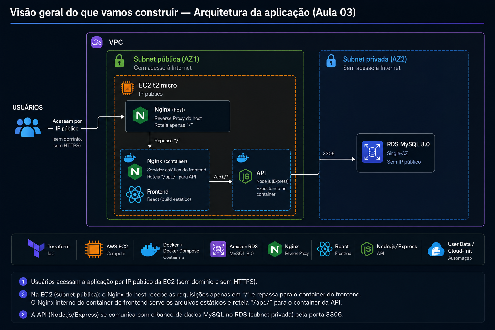

# Exercício Final — terraform-aula03

Chegou a hora de juntar **tudo** o que vimos nesta aula em um projeto só,
do zero, com as suas próprias mãos — do mesmo jeito que fizemos na Aula
02.

Nos módulos anteriores você praticou cada peça isoladamente: User Data
básico (módulo 02), a aplicação React + Node (módulo 03), o RDS MySQL
(módulo 04) e o provisionamento automático completo (módulo 05). Neste
exercício final, essas peças se juntam em **um único projeto Terraform**,
criado do zero em uma pasta separada.

A pasta [terraform-aula03/](terraform-aula03/) contém a solução completa
e comentada — use-a como gabarito se travar em algum passo, mas o
objetivo é que **você refaça cada etapa por conta própria**, na sua
máquina, digitando o código você mesmo.

---

## 🎯 O que você vai construir

Toda a infraestrutura abaixo, criada **inteiramente por código**, com um
único `terraform apply` — e, ao final dele, uma aplicação completa já no
ar, sem nenhum comando manual dentro da instância:



O diagrama técnico abaixo é a mesma arquitetura, com os dois elementos
que a imagem simplifica — **Internet Gateway/Route Table** e os
**Security Groups** de cada recurso — desenhados explicitamente:

```
┌──────────────────────────────── VPC (10.0.0.0/16) ────────────────────────────────┐
│                                                                                       │
│   Internet Gateway ── Route Table (0.0.0.0/0 → IGW)                                  │
│                                                                                       │
│   ┌────────── Subnet pública (AZ1) ──────────┐   ┌────────── Subnet privada (AZ2) ──┐│
│   │                                             │   │                                  ││
│   │   EC2 (t2.micro) — Amazon Linux 2023        │   │   RDS MySQL 8.0 (db.t3.micro)    ││
│   │   User Data: Docker + Compose + Git + Nginx │◄──┤   publicly_accessible = false    ││
│   │   Clona app-aula03, sobe frontend + api      │3306   DB Subnet Group (AZ1 + AZ2)  ││
│   │   Nginx do host repassa "/" ao frontend;     │   │                                  ││
│   │   o frontend roteia "/api" internamente      │   │                                  ││
│   │   SG: SSH (meu IP) + HTTP/HTTPS (público)    │   │   SG: 3306 só a partir do SG EC2 ││
│   └────────────────────────────────────────────┘   └──────────────────────────────────┘│
└──────────────────────────────────────────────────────────────────────────────────────┘
```

- **Rede** — VPC, Subnet pública, Subnet privada (2ª AZ), Internet
  Gateway, Route Table (módulos 04 e reaproveitado da Aula 02).
- **Segurança** — Security Group da EC2 (Aula 02) + Security Group do
  RDS, liberando 3306 só a partir do SG da EC2 (módulo 04).
- **Banco** — RDS MySQL, isolado, sem IP público (módulo 04).
- **Servidor + aplicação** — EC2 que se autoprovisiona via `user_data`
  (Docker, Compose, Git, Nginx) e sobe a aplicação `app-aula03`
  (frontend React + API Node), já conectada ao RDS (módulo 05).

Ou seja: este exercício não tem conceito novo — ele testa se você
consegue **organizar, do zero, um projeto completo de infraestrutura +
provisionamento automático**, juntando tudo o que já funcionou em
módulos separados.

---

## 🛠️ Passo a passo

### 1. Iniciar o Lab e atualizar as credenciais

Sempre o primeiro passo do dia: Start Lab → AWS Details → atualizar
`~/.aws/credentials`. Baixe também o `vockey.pem` (seção "SSH key" da
mesma tela).

### 2. Confirmar que a aplicação está pronta

Antes de mexer no Terraform, confirme que o repositório `app-aula03`
(módulo 03) está publicado no GitHub e que você já testou localmente que
ele sobe e funciona com `docker compose up -d --build`.

### 3. Criar a estrutura de pastas

```bash
mkdir terraform-aula03
cd terraform-aula03
```

Mova o `vockey.pem` baixado para dentro desta pasta.

```
terraform-aula03/
├── main.tf                    # terraform {} + provider "aws"
├── variables.tf                # todas as variáveis
├── network.tf                  # VPC, Subnet pública, IGW, Route Table
├── network-rds.tf              # Subnet privada + DB Subnet Group
├── security-group.tf           # Security Group da EC2
├── rds.tf                       # Security Group do RDS + aws_db_instance
├── ec2.tf                       # AMI, key pair, EC2 com user_data via templatefile
├── user_data.sh.tpl            # script de provisionamento automático
├── nginx-app.conf              # config do Nginx (reverse proxy)
├── outputs.tf                   # outputs de todos os recursos
├── terraform.tfvars            # my_ip, db_name, db_username, db_password, app_repo_url (NÃO commitar)
└── vockey.pem                   # baixado do Learner Lab (NÃO commitar)
```

### 4. Recriar os arquivos `.tf` e os scripts

Use os arquivos deste módulo como referência:
[`main.tf`](terraform-aula03/main.tf),
[`variables.tf`](terraform-aula03/variables.tf),
[`network.tf`](terraform-aula03/network.tf),
[`network-rds.tf`](terraform-aula03/network-rds.tf),
[`security-group.tf`](terraform-aula03/security-group.tf),
[`rds.tf`](terraform-aula03/rds.tf),
[`ec2.tf`](terraform-aula03/ec2.tf),
[`user_data.sh.tpl`](terraform-aula03/user_data.sh.tpl),
[`nginx-app.conf`](terraform-aula03/nginx-app.conf),
[`outputs.tf`](terraform-aula03/outputs.tf).

### 5. Descobrir seu IP e criar o `terraform.tfvars`

```bash
curl https://checkip.amazonaws.com
```

Copie [`terraform.tfvars.example`](terraform-aula03/terraform.tfvars.example)
para `terraform.tfvars` e preencha `my_ip`, `db_password` e
`app_repo_url` (a URL HTTPS do seu repositório `app-aula03` no GitHub).
Neste projeto, `app_repo_url` aponta para
[github.com/paulocsouzah/app-aula03](https://github.com/paulocsouzah/app-aula03.git)
— o repositório usado como base da aplicação para esta aula.
`db_name` e `db_username` já têm valores padrão em `variables.tf` — só
sobrescreva se quiser nomes diferentes.

### 6. Adicionar o `.gitignore`

Garanta que `terraform.tfstate*`, `terraform.tfvars` e `*.pem` nunca
sejam commitados — igual à Aula 02.

### 7. Inicializar, validar e planejar

```bash
terraform init
terraform fmt
terraform validate
terraform plan
```

Confira: o `plan` deve mostrar o total de recursos a criar (rede + RDS +
security groups + instância).

### 8. Aplicar

```bash
terraform apply
```

Confirme com `yes`. ⏳ **O RDS demora 5-10 minutos** — é normal e
esperado, como visto no módulo 04. Guarde os outputs, principalmente
`instance_public_ip` e `db_endpoint`.

### 9. Validar a aplicação no navegador

Acesse `http://<instance_public_ip>`. Cadastre pelo menos um usuário
pela tela e confirme que ele aparece na listagem (prova de que o
caminho completo — React → Nginx → API → RDS — está funcionando).

### 10. Conferir tudo no Console

Console da AWS → confirme visualmente: VPC, as duas Subnets (pública e
privada), Security Groups, a instância EC2 `running` e o banco RDS
`Available`, sem IP público.

### 11. Destruir ao final

Depois de validar e coletar os prints para o relatório:

```bash
terraform destroy
```

Confirme com `yes`. Confirme no Console que tudo foi removido.

⚠️ **Não deixe recursos rodando sem necessidade** — o orçamento da AWS
Academy é compartilhado entre todas as aulas do módulo, e o RDS custa
mais do que uma EC2 parada.

---

## ✅ Checklist técnico

- [ ] Pasta `terraform-aula03` criada com a estrutura de arquivos indicada
- [ ] Repositório `app-aula03` publicado no GitHub e testado localmente
- [ ] `terraform.tfvars` preenchido (não commitado)
- [ ] `terraform init`, `fmt` e `validate` executados sem erro
- [ ] `terraform plan` sem surpresas, `terraform apply` concluído
- [ ] RDS `Available`, sem IP público, conferido no Console
- [ ] EC2 provisionada sozinha (Docker, Compose, Git, Nginx instalados via User Data)
- [ ] Aplicação acessível no navegador, cadastro de usuário validado ponta a ponta
- [ ] Nenhum comando de configuração executado manualmente dentro da instância
- [ ] `terraform destroy` executado ao final, ambiente limpo

---

## 📄 Entrega: relatório em PDF

Este exercício não termina em rodar o projeto — ele termina quando eu
recebo o seu **relatório em PDF**, documentando tudo o que você fez. É
esse PDF que eu vou usar para avaliar e lançar sua nota.

### O que o PDF precisa conter

1. **Capa** — seu nome completo e a data de entrega.
2. **Prints de tela** de, no mínimo:
   - `terraform plan` mostrando os recursos a serem criados;
   - `terraform apply` concluído, com os outputs visíveis;
   - o Console da AWS mostrando o RDS `Available` (sem IP público) e a
     EC2 `running`;
   - o `cloud-init-output.log` mostrando o `user_data` executando até o
     fim, sem intervenção manual;
   - a aplicação funcionando no navegador, com pelo menos um usuário
     cadastrado;
   - `terraform destroy` concluído ao final.
3. **Os comandos que você executou**, na ordem, do primeiro ao último.
4. **Respostas escritas, com suas próprias palavras**, para as perguntas
   de reflexão abaixo.
5. **Dificuldades encontradas** — conte pelo menos um problema real que
   você teve (erro no User Data, Security Group bloqueando conexão,
   credencial expirada, o que for) e como você resolveu. Isso mostra que
   você realmente executou o exercício, e não só copiou o gabarito.

### Perguntas de reflexão (responda todas no PDF)

1. Explique, com suas próprias palavras, a diferença entre a EC2 da Aula
   02 (criada "vazia") e a EC2 desta aula (criada já com a aplicação no
   ar). O que mudou na forma como o servidor é tratado?
2. Por que o banco de dados desta aula é um RDS, e não um container
   MySQL dentro da mesma EC2 que roda a aplicação? Que problema real
   isso evita?
3. O que é `templatefile()` e por que ele foi necessário neste projeto,
   em vez do `file()` simples usado no módulo 02?
4. O Security Group do RDS libera a porta 3306 referenciando o Security
   Group da EC2, em vez de um CIDR fixo. Explique essa escolha.
5. Se você rodasse `terraform apply` uma segunda vez sem alterar nenhum
   arquivo, o que aconteceria? E se você alterasse o `user_data.sh.tpl` e
   rodasse de novo — o que muda em relação ao caso anterior?
6. Por que preferimos o mecanismo nativo de `user_data` da AWS a um
   `provisioner "remote-exec"` do Terraform para configurar a instância?

### Como gerar o PDF

Escreva o relatório em qualquer editor (Word, Google Docs, Markdown, o
que for mais confortável para você) e exporte/imprima como PDF.

### Prazo e envio

Envie o PDF por e-mail (ou pelo canal combinado em sala) até a data que
eu informar durante a aula. Nomeie o arquivo como
`terraform-aula03-SEUNOME.pdf`.

---

## 📊 Rubrica de avaliação

| Critério | Pontos |
|---|---|
| Rede completa criada corretamente (VPC, 2 Subnets/AZs, IGW, Route Table) | 1,5 |
| RDS criado corretamente (sem IP público, Security Group restrito ao SG da EC2) | 2,0 |
| EC2 provisionada automaticamente (Docker, Compose, Git, Nginx via User Data) | 2,0 |
| Aplicação funcionando ponta a ponta (frontend → API → RDS), validada no navegador | 2,0 |
| Nenhum comando de configuração executado manualmente dentro da instância | 1,0 |
| Relatório completo: prints, comandos e explicações próprias | 1,0 |
| Respostas às perguntas de reflexão demonstrando entendimento real | 0,5 |
| **Total** | **10,0** |

Parabéns por chegar até aqui — você percorreu todo o caminho: **User
Data e Cloud-Init → aplicação React + Node → banco de dados gerenciado
→ provisionamento 100% automático**. Sua EC2 agora nasce pronta para
receber tráfego real, sem depender de ninguém digitar um comando nela.
🚀
